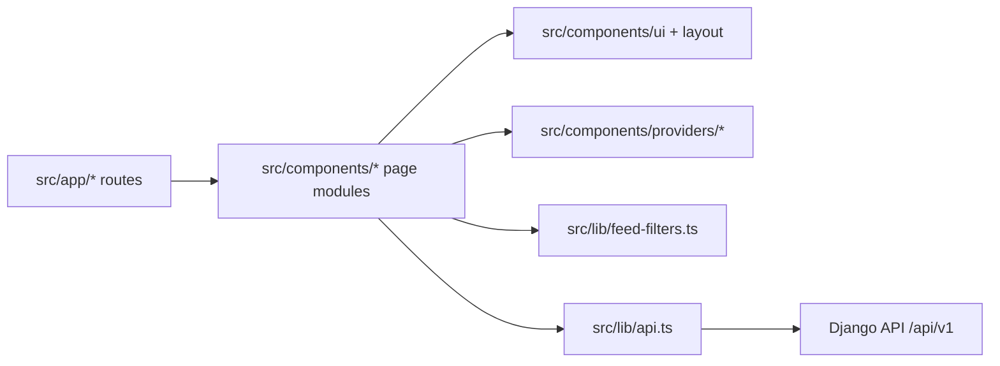

# EcoDesman Web: Frontend Architecture

## Назначение

`EcoDesman-web` это Next.js App Router клиент для публичного сайта, ленты, событий, карты, профилей и админского кабинета.

## Карта модулей



## Структура каталогов

- `src/app`:
  App Router маршруты и входные страницы.
- `src/components/feed`:
  лента, события, пагинация, фильтры, поиск.
- `src/components/post`:
  карточка публикации, детали, редактор.
- `src/components/profile`:
  публичный профиль и настройки.
- `src/components/admin`:
  moderation UI для постов, пользователей и точек карты.
- `src/components/layout`:
  shell, топбар, навигация.
- `src/components/providers`:
  auth/theme/providers для client-side state.
- `src/lib/api.ts`:
  HTTP слой, refresh токена, CRUD к Django API.
- `src/lib/feed-filters.ts`:
  единая точка правды для query-параметров ленты и событий.

## Поток данных в ленте

1. Route (`src/app/page.tsx`, `src/app/events/page.tsx`, `src/app/favorites/page.tsx`) рендерит страницу ленты.
2. `FeedPageContent` читает query string через `readFeedRequestFilters(...)`.
3. `FeedFilters` читает и пишет тот же контракт через `readFeedToolbarState(...)` и `buildFeedFilterSearchParams(...)`.
4. `listPosts(...)` преобразует UI-фильтры в API query и запрашивает Django backend.
5. `FeedPostList` и `FeedPagination` отрисовывают результат без дублирования бизнес-логики.

## Контракт фильтров

| UI поле | Query в браузере | Query в API | Источник истины |
| --- | --- | --- | --- |
| Сортировка | `ordering=recommended|recent|popular` | `ordering=...` | `src/lib/feed-filters.ts` |
| Когда | `event_scope=all|today|week|upcoming` | `event_scope=...` | `src/lib/feed-filters.ts` |
| Только с фото | `has_images=1` | `has_images=true` | `src/lib/feed-filters.ts` + `src/lib/api.ts` |
| Страница | `page=N` | `page=N` | `FeedPagination` + `readFeedRequestFilters(...)` |

## Deployment contract

- локальный dev:
  `.env.local` обычно указывает на `http://127.0.0.1:8000/api/v1`.
- production:
  фронт собирается из `EcoDesman-server/compose.yaml`.
- production API base:
  базовый рекомендованный URL для браузера это относительный `/api/v1`, который проксируется nginx на Django.

## Проверка после изменений

```bash
npm run lint
npm run build
```
